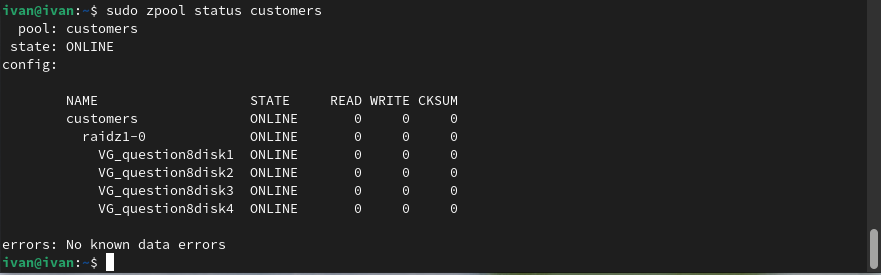

# Lab - Chapter 11

## Lab 11 Objectives

* Creating virtual disks in VirtualBox
* Creating new partitions in fdisk
* Creating new filesystems with mkfs
* Creating new filesystems in ZFS and Btrfs
* Mounting new filesystems
* Editing `/etc/fstab` and using systemd .mount files to make our mounts permanent

## Lab 11 Outcomes

At the conclusion of this lab you will have successfully created a new virtual disk in VirtualBox, created new partitions using fdisk, formatted those partitions using mkfs, XFS, and ZFS, and mounted all those partitions manually and automatically using the `/etc/fstab`.

## Lab 11 Activities

1. Create 2 virtual drives in VirtualBox (10 GB each):

   a. Use LVM to create 2 Physical Volumes

   

   

   b. Create 1 Volume Group

   

   c. Create 3 Logical Volumes of 5 GB each
   

   

   d. Format each LV using ext4

   

2. Using Fedora Linux, create 2 virtual drives in VirtualBox (10 GB each):

   a. Use LVM to create 2 Physical Volumes

   

   b. Create 1 Volume Group

   

   c. Create 3 Logical Volumes of 5 GB each

   

   d. Format one LV using ext4, xfs, and then btrfs

   

3. Using the same Fedora Linux from questions two extend the ext4 partition to be 7 GB

Size Before Extending

   a. Use the `lvextend` command to extend the LV 

   

   b. Use the `resize2fs` command to extend the filesystem size

   

4. Using the same Fedora Linux from questions two extend the xfs partition to be 7 GB

   a. Use the `lvextend` command to extend the LV 

   

   b. Use the `grow_xfs` command to extend the filesystem size

   

5. Using Fedora Linux create 4 additional virtual disks (can be of 5-10 GB)

   a. Using Btrfs create a stripped mirror named `datastorage`

   

   

   b. Use Btrfs to print out status of Btrfs disks: `btrfs filesystem show`

   

   c. use the command: `btrfs filesystem df` to show filesystem use compare the results to `df -H`

   

   

6. Create a `.mount` file to mount the Btrfs disk created in previous question

   a. Run the `df -H` before creating the `.mount` file and after reboot to show the disk has been mounted

   Before reboot

   

   After reboot

   

   b. You will need the UUID from the `lsblk -fs` command

   

   b. Remember like systemd, you will have to enable and start the `.mount` file

   

   c. Change ownership of the mount directory to your user

   

   d. Write a file named `helloworld.txt` to the newly mounted directory

   

7. Using Ubuntu Server, enable an additional host-only network interface and SSH from your Host OS into this system

   a. Create 3 virtual disks to attach to the virtual machine in VirtualBox

   

   b. Install the `zfsutils-linux` package for the zfs tools

   

   c. Create a 3 disk zfs stripe named: `datadisk`

   

   d. Change ownership of the mountpoint to your user

   

   e. Write a file named: `helloworld.txt` to the new mountpoint

   

8. Using Ubuntu Server, SSH from your Host OS into this system

   b. Attach 4 additional virtual disks to the virtual machine in VirtualBox

   

   c. Create a 4 disk RaidZ named: `customers`

   

   d. Change ownership of the mountpoint to your user

   

   e. Write a file named: `helloworld.txt` to the new mountpoint

   

   f. Display the `zpool status` and take a screenshot of the output

   
 
9. Using Ubuntu Server, SSH from your Host OS into this system

   b. Inside of zfspool named `customers`, create 2 `datasets` named: `customers/joseph` and `customers/evelyn`

   

   c. List the `datasets`

   

   d. Issue the command: `truncate -s 500m accounts.csv` to create a 500 mb file named accounts.csv in each dataset

   

   e. Create a ZFS snapshot of the volume named `customers/joseph` naming it: `customer-snap1`

   

   f. Using the `truncate` command create two more files: `ubuntu-distros.csv` and `fedora-distros.csv` of 100 mb on the `customers/joseph` volume

   

   g. Issue the `ls -lh` command on the `customers/joseph` volume to show that the new files have been created

   

   h. Using the `zfs list` command list the current snapshots

   

   i. Using the `zfs rollback` command the `customer-snap1` snapshot

   

   j. Issue the `ls -lh` command on the `customers/joseph` volume to show that the snapshot has been rolled back

   

10. Using Ubuntu Server, SSH from your Host OS

   a. Execute a `zpool status customers/evelyn` command

   

   b. Enable LZ4 compression on the zpool datapool

   

   c. Execute a `zfs get all | grep compression` command to display that compression is enabled

   

11. Execute any of the commands listed in the text to print out the disk serial numbers

12. Attach an additional 2 GB virtual disk and format it with Btrfs and we will mount is in read-only mode. Using the command `lsblk --fs /dev/sdX` determine the UUID of the newest virtual disk you just created. Add an entry for this disk to the `/etc/fstab` file with the following values:

   a. file system is UUID=

   

   b. mount point is `/mnt/disk100` (create this partition if it doesn't exist)

   

   c. type is btrfs

   d. options: defaults,ro  (ro for read-only)

   e. dump and pass fields can be 0

   

   f. Change owner and group to your username for `/mnt/disk100` (using `chmod`)

   

   g. Reboot your system. Change directory to `/mnt/disk100` and take a screenshot to demonstrate that the disk is in read-only mode by trying to create a file via this command:  `touch demo.txt`

   

13. Using `wget`, retrieve this URL: https://mirrors.edge.kernel.org/pub/linux/kernel/v5.x/linux-5.11.19.tar.xz

   a. Untar/uncompress this archive.

   

   b. Tar the directory and compress it using bzip2, make sure to keep the original input

   

   c. Tar the directory and compress it using gzip, make sure to keep the original input

   

   d. Tar the directory and compress it using ztd, make sure to keep the original input

   

   e. Tar the directory and compress it using xz, make sure to keep the original input
   
   